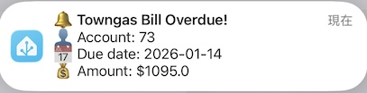
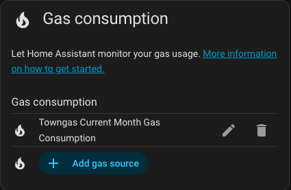

# Hong Kong Towngas for Home Assistant 🔥

[](https://github.com/hacs/integration) [](https://buymeacoffee.com/vin_w)

English | [繁體中文](./README_zh-Hant.md)

A Home Assistant custom integration for monitoring your [Hong Kong Towngas](https://eservice.towngas.com) gas consumption and billing via the eService portal.

<!-- TODO: capture new screenshot -->


<!-- TODO: capture new screenshot -->


## Features ⭐

- 🔥 Monthly gas consumption in MJ and meter units (度數)
- 📊 Cumulative meter reading (煤氣錶讀數)
- 💰 Estimated tariff based on actual usage and current fuel rate
- 👥 Supports multiple Towngas accounts
- 📊 Compatible with the Home Assistant Energy Dashboard
- 🧩 Setup via UI (no YAML required)

## Installation

### HACS (Recommended)

[](https://my.home-assistant.io/redirect/hacs_repository/?owner=vin-w&repository=hass-towngas-hk&category=integration)

Or manually add `https://github.com/vin-w/hass-towngas-hk` as a Custom Repository in HACS.

---

## Configuration ⚙️

[](https://my.home-assistant.io/redirect/config_flow_start/?domain=towngas_hk)

1. **Settings → Devices & Services → Add Integration**
2. Search **Hong Kong Towngas**
3. Enter your Towngas eService username and password
4. Select your account (if multiple accounts exist).

## Sensors 🔍

Each configured Towngas account is added as a **device** (named `Towngas HK Account <number>`) with the following entities:

| Entity ID | Unit | Description |
|-----------|------|-------------|
| `sensor.towngas_hk_{account}_consumption` | MJ | Monthly gas consumption (最新本月用量) |
| `sensor.towngas_hk_{account}_consumption_units` | Units | Monthly consumption in meter units (本月度數) |
| `sensor.towngas_hk_{account}_meter_reading` | Units | Cumulative meter reading (煤氣錶讀數) |
| `sensor.towngas_hk_{account}_reading_type` | — | How reading was obtained: Remote / Actual / Estimate |
| `sensor.towngas_hk_{account}_reading_date` | Date | When the latest reading was taken |
| `sensor.towngas_hk_{account}_latest_reading_text` | — | Pre-formatted latest reading info (when available) |
| `sensor.towngas_hk_{account}_tariff_estimate` | HKD | Estimated bill based on latest consumption |
| `sensor.towngas_hk_{account}_account_no` | — | Towngas account number |
| `sensor.towngas_hk_{account}_balance` | HKD | Current account balance |
| `sensor.towngas_hk_{account}_bill_amount` | HKD | Latest bill amount due |
| `sensor.towngas_hk_{account}_bill_due_date` | Date | Bill payment due date |

### Attributes on `consumption` sensor

| Attribute | Description |
|-----------|-------------|
| `reading_type` | Remote / Actual / Estimate |
| `reading_date` | ISO date of the reading |
| `meter_reading` | Cumulative meter total (units) |
| `consumption_units` | Raw consumption in units |
| `has_prediction` | Whether Towngas shows a prediction forecast |
| `latest_reading_text` | Pre-formatted text from API |

### Attributes on `tariff_estimate` sensor

| Attribute | Description |
|-----------|-------------|
| `consumption_mj` | MJ used for calculation |
| `fuel_rate_cents` | Current fuel adjustment rate (¢/MJ) |
| `tariff_source` | Official tariff page URL |
| `tariff_effective_date` | When rates were last updated |

### Attributes on `balance` sensor

| Attribute | Description |
|-----------|-------------|
| `updated_date` | Date balance was last updated |
| `auto_pay` | Whether auto-pay is enabled |
| `ibill` | Whether iBill (e-statement) is enrolled |
| `account_status` | Account status (`A` = Active) |

### Fuel adjustment helper

An `input_number` helper named `Towngas <account> Fuel Adjust Rate` is created
when the integration is set up. It defaults to **4.52 ¢/MJ** and can be edited
via **Settings → Devices & Services → Helpers**. The tariff sensor reads this
value to compute charges; if the helper is missing the default rate is used.

## Usage and Meter Units Explanation

- **Usage (MJ)** refers to the gas thermal energy consumption shown at each meter reading, measured in megajoules (MJ)—the actual billed consumption value.
- **Meter Units** are the traditional meter-style display calculated as every 48 MJ per unit, which is Towngas's standard on their website and paper bills.

The conversion is: `units × 48 = MJ`

## Billing Cycle Explanation

The monthly usage sensor represents the **most recently completed meter reading cycle**. Towngas typically reads meters at the beginning of each month. The integration uses `historyList` from the API which always has the latest data (including manual reads before chartBarList updates).

**Official resources:**
- Tariff rates: https://www.towngas.com/en/Household/Customer-Services/Tariff
- How to read your gas bill: https://www.towngas.com/media/getmedia/2f4237d6-bd4c-4f13-9b7c-50b009183468/how-to-read-bill_chi.pdf

## Dashboard example 🖥️

<!-- TODO: capture new screenshot -->

You can add a simple Towngas card stack to any dashboard:

```yaml
type: vertical-stack
cards:
  - type: history-graph
    title: Towngas Usage (Monthly)
    entities:
      - entity: sensor.towngas_hk_{account}_consumption
        name: Consumption (MJ)
    hours_to_show: 720
  - type: entities
    state_color: true
    entities:
      - entity: sensor.towngas_hk_{account}_consumption
      - entity: sensor.towngas_hk_{account}_consumption_units
      - entity: sensor.towngas_hk_{account}_meter_reading
      - entity: sensor.towngas_hk_{account}_reading_type
      - entity: sensor.towngas_hk_{account}_reading_date
      - entity: sensor.towngas_hk_{account}_tariff_estimate
```

## Energy Dashboard ⚡

Go to **Settings → Dashboards → Energy** and add `sensor.towngas_hk_{account}_consumption` (in MJ) under **Gas consumption**.

<!-- TODO: capture new screenshot -->


## Automation Blueprint 🔁

A convenient automation blueprint is included to alert you when your
Towngas bill becomes overdue. You can import it directly using the
button below or by using the URL:

[](https://my.home-assistant.io/redirect/blueprint_import/?blueprint_url=https%3A%2F%2Fgithub.com%2Fvin-w%2Fhass-towngas-hk%2Fblob%2Fmaster%2Fblueprints%2Foverdue_bill_alert_en.yaml)

[https://github.com/vin-w/hass-towngas-hk/blob/master/blueprints/overdue_bill_alert_en.yaml](https://github.com/vin-w/hass-towngas-hk/blob/master/blueprints/overdue_bill_alert_en.yaml)

Once imported, create an automation from the blueprint and configure the
inputs:

1. **Overdue Bill Sensor** – select `binary_sensor.overdue_bill` for your
   Towngas account.
2. **Notification Service** – choose a notify service (e.g.
   `notify.mobile_app_yourphone`).

The built automation will fire when the sensor turns **on**, sending a
title/message to the chosen notify target.

## Requirements 📦

- Towngas eService account at https://eservice.towngas.com
- Home Assistant 2025.1.0 or newer

## Support the integration 🤝

### Issues and pull requests

If you run into any problems or have ideas for improvements, feel free to open a new [issue](https://github.com/vin-w/hass-towngas-hk/issues/new/choose). You're also very welcome to send a [pull request](https://github.com/vin-w/hass-towngas-hk/pulls) if you'd like to contribute code or documentation!

### Other support

This is a free‑time, unofficial project. If you find it useful, you can buy me a coffee to show your appreciation:

[](https://buymeacoffee.com/vin_w)

---

## Disclaimer ⚠️

This project is an independent, unofficial integration and is not affiliated with The Hong Kong and China Gas Company Limited.
