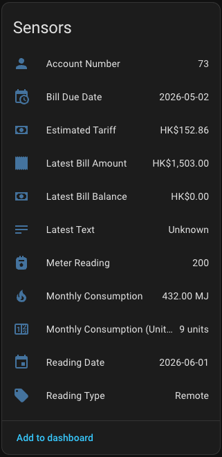

# Hong Kong Towngas for Home Assistant 🔥

[](https://github.com/hacs/integration) [](https://buymeacoffee.com/vin_w)

English | [繁體中文](./README_zh-Hant.md)

A Home Assistant custom integration for monitoring your [Hong Kong Towngas](https://eservice.towngas.com) gas consumption and billing via the eService portal.



## Features ⭐

- 🔥 Monthly gas consumption in MJ and meter units (度數)
- 📊 Cumulative meter reading (煤氣錶讀數)
- 💰 Estimated tariff based on actual usage and current fuel rate
- 👥 Supports multiple Towngas accounts
- 📊 Compatible with the Home Assistant Energy Dashboard
- 🧩 Setup via UI (no YAML required)
- 🔄 Auto-refresh with smart caching (monthly billing cycle)
- 🔔 Bill overdue alerts via automation blueprint

## Installation

### HACS (Recommended)

[](https://my.home-assistant.io/redirect/hacs_repository/?owner=vin-w&repository=hass-towngas-hk&category=integration)

Or manually add `https://github.com/vin-w/hass-towngas-hk` as a Custom Repository in HACS.

---

## Configuration ⚙️

[](https://my.home-assistant.io/redirect/config_flow_start/?domain=towngas_hk)

1. **Settings → Devices & Services → Add Integration**
2. Search **Hong Kong Towngas**
3. Enter your Towngas eService username and password
4. ☐ **Save password for auto-refresh** — tick this if you want automatic data updates without re-authentication
5. You'll receive a **6-digit OTP code** via email — enter it to verify your identity
6. Select your account (if multiple accounts exist)

---

## Authentication & Data Refresh 🔐

Towngas requires **OTP (One-Time Password) verification** for every login. This is a security measure by Towngas — there is no way to bypass it.

### How data refresh works

Data is fetched once every **30 days** (aligned with monthly billing cycle). Between refreshes, cached data is displayed instantly — no network calls needed.

On restart, the integration loads cached data immediately. Fresh data is only fetched when the 30-day interval elapses.

### Save password option

During setup and re-authentication, you can tick **"Save password for auto-refresh"**:

| Option | Behaviour |
|--------|-----------|
| **Saved** | Password is prefilled on re-authentication — you just confirm and enter OTP |
| **Not saved** | You must type your password manually each time you re-authenticate |

Both options follow the same 30-day refresh cycle. The difference is only convenience during re-authentication.

### When re-authentication is needed

- **Every 30 days** — when the refresh interval elapses, the coordinator needs fresh credentials
- **Session expired** — HA shows a "Re-authenticate" notification in Settings → Integrations
- **Force Refresh** — click the button to manually trigger fresh data (requires re-auth if session expired)

### Re-authentication flow

1. Click **Re-authenticate** in the repair notification (or click **Force Refresh**)
2. Enter your password (pre-filled if saved, otherwise type it)
3. ☐ Tick **Save password for auto-refresh** if you want convenience next time
4. Enter the **6-digit OTP code** sent to your email
5. Done — fresh data loaded

### Without saved password

If you chose not to save your password:
- Data refreshes work the same way (30-day cycle)
- When re-authentication is needed, you must type your password manually
- You can enable "Save password" during re-authentication to prefill it next time

---

## Sensors 🔍

Each configured Towngas account is added as a **device** (named `Towngas HK Account <number>`) with the following entities:

| Entity ID | Unit | Description |
|-----------|------|-------------|
| `sensor.towngas_hk_{account}_consumption` | MJ | Monthly gas consumption |
| `sensor.towngas_hk_{account}_consumption_units` | Units | Monthly consumption in meter units |
| `sensor.towngas_hk_{account}_meter_reading` | Units | Cumulative meter reading |
| `sensor.towngas_hk_{account}_reading_type` | — | How reading was obtained: Remote / Actual / Estimate |
| `sensor.towngas_hk_{account}_reading_date` | Date | When the latest reading was taken |
| `sensor.towngas_hk_{account}_latest_reading_text` | — | Pre-formatted latest reading info |
| `sensor.towngas_hk_{account}_tariff_estimate` | HKD | Estimated bill based on latest consumption |
| `sensor.towngas_hk_{account}_account_no` | — | Towngas account number |
| `sensor.towngas_hk_{account}_balance` | HKD | Latest bill balance (overdue if > $0) |
| `sensor.towngas_hk_{account}_bill_amount` | HKD | Latest bill amount |
| `sensor.towngas_hk_{account}_bill_due_date` | Date | Bill payment due date |

### Button entity

| Entity ID | Description |
|-----------|-------------|
| `button.towngas_hk_{account}_force_refresh` | Force a fresh data fetch (clears cache and re-authenticates) |

### Sensor attributes

**consumption** sensor:
| Attribute | Description |
|-----------|-------------|
| `reading_type` | Remote / Actual / Estimate |
| `reading_date` | ISO date of the reading |
| `meter_reading` | Cumulative meter total (units) |
| `consumption_units` | Raw consumption in units |
| `has_prediction` | Whether Towngas shows a prediction forecast |
| `latest_reading_text` | Pre-formatted text from API |

**tariff_estimate** sensor:
| Attribute | Description |
|-----------|-------------|
| `consumption_mj` | MJ used for calculation |
| `fuel_rate_cents` | Current fuel adjustment rate (¢/MJ) |
| `tariff_source` | Official tariff page URL |
| `tariff_effective_date` | When rates were last updated |

**balance** sensor:
| Attribute | Description |
|-----------|-------------|
| `updated_date` | Date balance was last updated |
| `auto_pay` | Whether auto-pay is enabled |
| `ibill` | Whether iBill (e-statement) is enrolled |
| `account_status` | Account status (`A` = Active) |

---

## Tariff & Billing 💰

### How tariff estimation works

The estimated tariff is calculated using:
1. **Tiered gas charges** — per-MJ pricing based on consumption brackets
2. **Fuel cost adjustment** — variable rate (default: 4.52 ¢/MJ)
3. **Monthly maintenance charge** — HK$10
4. **Monthly initial charge** — HK$20 (only if gas charge < $20)

Source: [Towngas Tariff](https://www.towngas.com/en/Household/Customer-Services/Tariff)

### Usage and Meter Units

- **Usage (MJ)** — gas thermal energy consumption, measured in megajoules. This is the actual billed value.
- **Meter Units** — traditional meter display, where 1 unit = 48 MJ.

Conversion: `units × 48 = MJ`

### Billing cycle

The monthly usage sensor represents the **most recently completed meter reading cycle**. Towngas typically reads meters at the beginning of each month.

---

## Dashboard Examples 🖥️

### Lovelace card

```yaml
type: vertical-stack
cards:
  - type: history-graph
    title: Towngas Usage (Monthly)
    entities:
      - entity: sensor.towngas_hk_{account}_consumption
        name: Consumption (MJ)
    hours_to_show: 720
  - type: entities
    state_color: true
    entities:
      - entity: sensor.towngas_hk_{account}_consumption
      - entity: sensor.towngas_hk_{account}_consumption_units
      - entity: sensor.towngas_hk_{account}_meter_reading
      - entity: sensor.towngas_hk_{account}_tariff_estimate
      - entity: sensor.towngas_hk_{account}_balance
      - entity: sensor.towngas_hk_{account}_bill_amount
      - entity: sensor.towngas_hk_{account}_bill_due_date
      - entity: button.towngas_hk_{account}_force_refresh
```

### Energy Dashboard

Go to **Settings → Dashboards → Energy** and add `sensor.towngas_hk_{account}_consumption` (in MJ) under **Gas consumption**.

---

## Automation Blueprint 🔁

A blueprint is included to alert you when your Towngas bill balance exceeds $0 (bill overdue).

[](https://my.home-assistant.io/redirect/blueprint_import/?blueprint_url=https%3A%2F%2Fgithub.com%2Fvin-w%2Fhass-towngas-hk%2Fblob%2Fmaster%2Fblueprints%2Foverdue_bill_alert_en.yaml)

### Setup

1. Import the blueprint from the link above
2. Create an automation from the blueprint
3. Configure:
   - **Balance Sensor** — select `sensor.towngas_hk_{account}_balance`
   - **Notification Service** — choose your notify service (e.g. `notify.mobile_app_yourphone`)
4. The automation fires when balance goes above $0

---

## Requirements 📦

- Towngas eService account at https://eservice.towngas.com
- Home Assistant 2026.1.0 or newer

---

## Support the integration 🤝

### Issues and pull requests

If you run into any problems or have ideas for improvements, feel free to open a new [issue](https://github.com/vin-w/hass-towngas-hk/issues/new/choose). You're also very welcome to send a [pull request](https://github.com/vin-w/hass-towngas-hk/pulls) if you'd like to contribute code or documentation!

### Other support

This is a free-time, unofficial project. If you find it useful, you can buy me a coffee to show your appreciation:

[](https://www.buymeacoffee.com/vin_w)

---

## Disclaimer ⚠️

This project is an independent, unofficial integration and is not affiliated with The Hong Kong and China Gas Company Limited.
