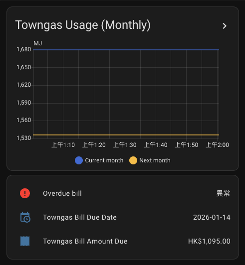
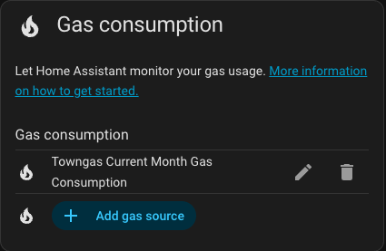

# 香港中華煤氣 for Home Assistant 🔥

[](https://github.com/hacs/integration) [](https://buymeacoffee.com/vin_w)

繁體中文 | [English](./README.md)

香港中華煤氣 Home Assistant 自訂整合，用於透過 eService 門戶監控您的煤氣用量和帳單。



## 特色 ⭐

- 🔥 現月與次月煤氣用量及度數（實測或估計）
- 💰 帳單歷史（HKD）
- 👥 支援多個中華煤氣帳戶
- 📊 相容 Home Assistant 能源儀表板
- 🧩 UI 設定（無需 YAML）

## 安裝

### HACS（推薦）

[](https://my.home-assistant.io/redirect/hacs_repository/?owner=vin-w&repository=hass-towngas-hk&category=integration)

或者在 HACS 中手動新增 `https://github.com/vin-w/hass-towngas-hk` 作為自訂儲存庫。

---

## 設定 ⚙️

[](https://my.home-assistant.io/redirect/config_flow_start/?domain=towngas_hk)

1. **設定 → 設備與服務 → 新增整合**
2. 搜尋 **香港中華煤氣**
3. 輸入您的中華煤氣 eService 使用者名稱和密碼
4. 選擇您的帳戶（若有多個帳戶）

## 感測器 🔍

每個已設定的中華煤氣帳戶將以**裝置**形式新增，包含以下實體：

| 實體 | 類型 | 單位 | 描述 |
|------|------|------|------|
| `sensor.towngas_hk_{account}_current_month_usage_mj` | 感測器 | MJ | 當月用量（最後抄表） |
| `sensor.towngas_hk_{account}_current_month_usage_unit` | 感測器 | 度數 | 當月度數（抄表顯示） |
| `sensor.towngas_hk_{account}_next_month_estimate_mj` | 感測器 | MJ | 下月估計用量 |
| `sensor.towngas_hk_{account}_next_month_estimate_unit` | 感測器 | 度數 | 下月估計度數 |
| `sensor.towngas_hk_{account}_account_no` | 感測器 | — | 中華煤氣帳戶號碼 |
| `sensor.towngas_hk_{account}_current_month_code` | 感測器 | — | 機器可讀的本月代碼（`YYYY-MM`） |
| `sensor.towngas_hk_{account}_next_month_code` | 感測器 | — | 機器可讀的下月代碼（`YYYY-MM`） |
| `binary_sensor.towngas_hk_{account}_current_month_usage_is_estimate` | 二元感測器 | — | 若當月數值為估計則為 `on` |
| `binary_sensor.towngas_hk_{account}_next_month_usage_is_estimate` | 二元感測器 | — | 若下月數值為估計則為 `on` |
| `sensor.towngas_hk_{account}_current_balance` | 感測器 | HKD | 帳戶結餘 |
| `sensor.towngas_hk_{account}_bill_amount_due` | 感測器 | HKD | 最近一期賬單金額 |
| `sensor.towngas_hk_{account}_bill_due_date` | 感測器 | 日期 | 賬單到期日 |
| `binary_sensor.towngas_hk_{account}_overdue_bill` | 二元感測器 | — | 逾期未繳時顯示為「問題」 |

### 屬性（由兩個用量感測器共用）

`sensor.towngas_hk_{account}_current_month_usage_mj/_unit` 和
`sensor.towngas_hk_{account}_next_month_estimate_mj_unit` 均提供下列簡潔屬性：

| 屬性 | 描述 |
|------|------|
| `month` | 感測器值所屬之月份字串（例如「Feb 2026」） |
| `is_estimate` | 若該數值為預估（非實際抄表）則為 True |

### 屬性（`sensor.current_balance`）

| 屬性 | 描述 |
|------|------|
| `updated_date` | 結餘最後更新日期 |
| `auto_pay` | 是否已設定自動轉賬 |
| `ibill` | 是否已登記電子賬單 |
| `account_status` | 帳戶狀態（`A` = 有效） |

## 用量與度數說明

- **用量 (MJ)** 指的是每次抄表時顯示的煤氣熱能消耗，以兆焦為單位，
  亦即賬單上的實際耗用數值。
- **度數** 是按每 48 MJ 計算的傳統電錶式顯示單位，也是中華煤氣
  在網站與紙本賬單上使用的標準。

### 帳單周期說明

當月用量感測器代表**最後完成的抄表周期**。中華煤氣通常在下月的 3-5 日進行抄表，因此在 **2026-02-27** 時，二月的數據約為 **1225 MJ**。下月估計為循環推估值，在下次抄表前可能顯示較小數值（例如 24 MJ）。

```
Feb 3–5 read → 1225 MJ (Feb usage)
                 ↘ billing cycle continues → estimate 24 MJ (Mar)
```

官方資源：
- 收費標準：https://www.towngas.com/tc/Household/Customer-Services/Tariff
- 如何閱讀煤氣單：https://www.towngas.com/media/getmedia/2f4237d6-bd4c-4f13-9b7c-50b009183468/how-to-read-bill_chi.pdf

## 儀表板範例 🖥️

您可以在任何儀表板中新增簡單的中華煤氣卡片堆疊：

```yaml
type: vertical-stack
cards:
  - type: history-graph
    title: 煤氣使用量（月度）
    entities:
      - entity: sensor.towngas_hk_{account}_current_month_usage_mj
        name: 當月 (MJ)
      - entity: sensor.towngas_hk_{account}_next_month_estimate_mj
        name: 下月估計 (MJ)
    hours_to_show: 720
  - type: entities
    state_color: true
    entities:
      - entity: binary_sensor.towngas_hk_{account}_overdue_bill
        name: 逾期帳單
      - entity: sensor.towngas_hk_{account}_bill_due_date
      - entity: sensor.towngas_hk_{account}_bill_amount_due
```

## 能源儀表板 ⚡

前往 **設定 → 儀表板 → 能源**，在 **煤氣消耗** 下新增 `sensor.towngas_hk_{account}_current_month_usage_mj`。



## 自動化藍圖 🔁

已內置一個方便使用的自動化藍圖，當你的
煤氣賬單逾期時會發出提醒。你可以使用下面的按鈕
或以下網址直接匯入藍圖：

[](https://my.home-assistant.io/redirect/blueprint_import/?blueprint_url=https%3A%2F%2Fgithub.com%2Fvin-w%2Fhass-towngas-hk%2Fblob%2Fmaster%2Fblueprints%2Foverdue_bill_alert_zh-Hant.yaml)

[https://github.com/vin-w/hass-towngas-hk/blob/master/blueprints/overdue_bill_alert_zh-Hant.yaml](https://github.com/vin-w/hass-towngas-hk/blob/master/blueprints/overdue_bill_alert_zh-Hant.yaml)

匯入後，請根據此藍圖建立一個自動化，並設定以下輸入：

1. **逾期賬單感測器** – 為你的煤氣賬戶選擇 `binary_sensor.overdue_bill`。
2. **通知服務** – 選擇一個通知服務（例如
   `notify.mobile_app_yourphone`）。

當感測器狀態變為 **on** 時，建立好的自動化會被觸發，
向所選的通知目標發送標題及訊息。


## 需求 📦

- 中華煤氣 eService 帳戶 [https://eservice.towngas.com](https://eservice.towngas.com)
- Home Assistant 2025.1.0 或更新版本

## 支持這個整合 🤝

### 問題與 Pull request

使用中遇到問題或有新功能想法，歡迎開啟新的 [issue](https://github.com/vin-w/hass-towngas-hk/issues/new/choose)。你也可以提交 [pull request](https://github.com/vin-w/hass-towngas-hk/pulls)，無論是程式碼或文件修改都很感謝！

### 其他支援

這是一個業餘時間開發的非官方專案。如果你覺得滿意，可以透過買杯咖啡支持我：

[](https://buymeacoffee.com/vin_w)

---

## 免責聲明 ⚠️

本專案為獨立的非官方整合，與香港中華煤氣有限公司無關亦未經其認可。
